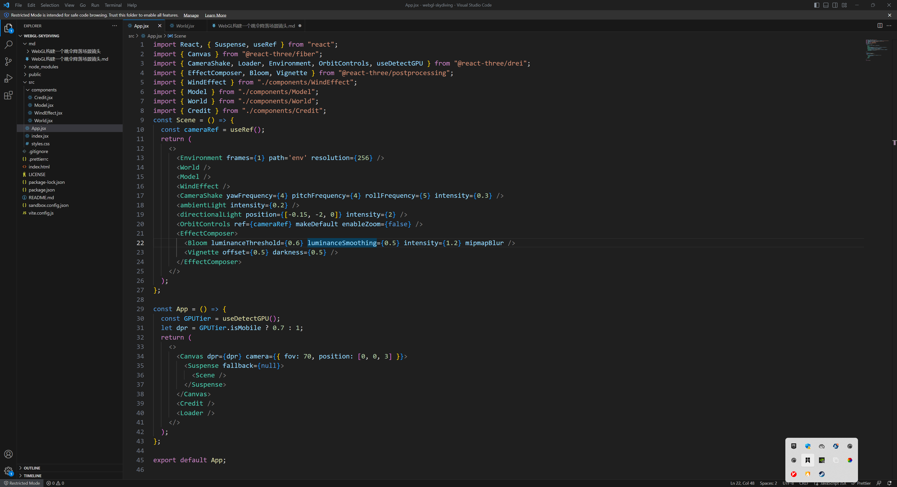

# 想跳伞嘛？在 WebGL 的世界中尽情降落吧！

> 这是我在 Github 开源中，Fork 的一个 WebGL 创意 Demo！
>
> 通过 WebGL 构建一个跳伞降落场景镜头，360 度旋转镜头，从高中俯视这一片大地，喊出来，“逃离城市的苦闷，我要掉到远方去！！！”。
>
> - [查看地址](https://webgl-skydiving.vercel.app/)
> - [仓库地址](https://github.com/WaterSeeding/webgl-skydiving)

<br />

## 介绍


如果所示，一个勇敢的少年，背着还未打开降落伞，投身如广袤的天地中，在重力的作用下，风都如何袖带般，在他身边穿梭而过，簌簌地声响肉眼可见，那强大的冲击力，震荡着整个天地都在晃荡~~

<br />

## 思路

> 好了以下，从代码角度介绍，作者开发历程：



1. 创建全景天空盒：

```tsx
import { useTexture } from "@react-three/drei";
import { Sphere } from "@react-three/drei";
import { BackSide } from "three";
export const World = () => {
  const skyTexture = useTexture("sky-texture.jpg");
  return (
    <Sphere args={[5, 60, 60]}>
      <meshBasicMaterial toneMapped={false} map={skyTexture} side={BackSide} />
    </Sphere>
  );
};
```

这里加载`skyTexture`纹理图片，设置到`meshBasicMaterial.map`属性，构建全景天空盒。


<br />

2. 添加少年人物模型：

```tsx
import { useEffect } from "react";
import { useFrame } from "@react-three/fiber";
import { useAnimations, useGLTF, useTexture } from "@react-three/drei";
import { DoubleSide } from "three";
export const Model = () => {
  const [skyDiverTextureBaseColor, skyDiverTextureRoughness, skyDiverTextureMetallic, skyDiverTextureNormal, skyDiverTextureClothes] =
    useTexture(
      [
        "texture/skydiver_BaseColor.webp",
        "texture/skydiver_Roughness.webp",
        "texture/skydiver_Metallic.webp",
        "texture/skydiver_Normal.webp",
        "texture/skydiver_Clothes.webp",
      ],
      ([baseColor, roughness, metallic, normal, clothes]) => {
        baseColor.flipY = roughness.flipY = metallic.flipY = normal.flipY = clothes.flipY = false;
      }
    );
  const test = useGLTF("/skydiver.glb");
  const { nodes, animations, scene } = useGLTF("/skydiver.glb");
  const { ref, actions, names } = useAnimations(animations, scene);
  const { mixamorigHips, skydiver_2: skydiver } = nodes;
  const onBeforeCompile = shader => {
    Object.assign(shader.uniforms, { ...skydiver.material.uniforms });
    shader.vertexShader = `
        uniform float uTime;
        uniform sampler2D uClothes;
        ${shader.vertexShader}
        `;
    shader.vertexShader = shader.vertexShader.replace(
      `#include <begin_vertex>`,
      `
          vec3 clothesTexture = vec3(texture2D(uClothes, vUv));
          float circleTime = 2.0;
          float amplitude = 30.0;
          float circleTimeParam = mod(uTime, circleTime);
          vec3 transformed = vec3( position );
          transformed.y += min(clothesTexture.y * sin( circleTimeParam * amplitude * (PI  / circleTime)) * 0.025, 0.5);
        `
    );
  };
  useEffect(() => {
    actions["animation_0"].reset().play();
    skydiver.material.uniforms = {
      uTime: { value: 0 },
      uClothes: { value: skyDiverTextureClothes },
    };
  }, []);
  useFrame(({ clock }) => {
    if (skydiver.material.uniforms?.uTime) {
      skydiver.material.uniforms.uTime.value = clock.getElapsedTime();
    }
  });
  return (
    <group dispose={null}>
      <group ref={ref}>
        <primitive object={mixamorigHips} />
        <skinnedMesh geometry={skydiver.geometry} skeleton={skydiver.skeleton}>
          <meshStandardMaterial
            side={DoubleSide}
            map={skyDiverTextureBaseColor}
            roughnessMap={skyDiverTextureRoughness}
            metalnessMap={skyDiverTextureMetallic}
            normalMap={skyDiverTextureNormal}
            normalScale={[-0.2, 0.2]}
            envMapIntensity={0.8}
            toneMapped={false}
            onBeforeCompile={onBeforeCompile}
            uniforms={{ uTime: { value: 0 } }}
          />
        </skinnedMesh>
      </group>
    </group>
  );
};
```

步骤：

- 使用`useGLTF`函数加载模型数据
- 将模型数据分解化成单个图元 DOM
- 为`skinnedMesh`骨骼 Mesh 添加材质（map 贴图、roughness 贴图、metalness 贴图、normal 贴图）
- 通过`meshStandardMaterial.onBeforeCompile`函数修改材质 shader，并在`useFrame`每帧修改`uTime`值


<br />

3. 添加袖带般的可视化风：

```tsx
import { useRef } from "react";
import { useFrame, useThree } from "@react-three/fiber";
import { Instances, Instance } from "@react-three/drei";
import { AdditiveBlending, DoubleSide, MathUtils } from "three";
import { Vector3 } from "three";

function WindShape() {
  const ref = useRef();
  const state = useThree();
  const { height: viewPortHeight } = state.viewport.getCurrentViewport();
  const v3 = new Vector3();
  const randomPosition = {
    x: MathUtils.randFloatSpread(8),
    y: MathUtils.randFloatSpread(5),
    z: MathUtils.randFloatSpread(8),
  };
  const randomSpeed = MathUtils.randFloat(0.05, 0.5);
  useFrame(({ camera }) => {
    if (ref.current) {
      const { current: el } = ref;
      const { height: elHeight } = el.instance.current.geometry.parameters;
      const { y: elPosition } = el.position;
      const worldPosition = el.getWorldPosition(v3);
      const limitPos = viewPortHeight - (worldPosition.y + elHeight / 2);
      if (limitPos < 0) {
        el.position.y = -(viewPortHeight + elHeight / 2);
      }
      el.position.y += randomSpeed;
      el.rotation.y = camera.rotation.y;
    }
  });
  return <Instance ref={ref} color='white' position={[randomPosition.x, randomPosition.y, randomPosition.z]} />;
}

export const WindEffect = () => {
  const INSTANCE = {
    number: 130,
  };
  return (
    <group>
      <Instances>
        <planeGeometry args={[0.0135, 1.2]} />
        <meshBasicMaterial side={DoubleSide} blending={AdditiveBlending} opacity={0.15} transparent />
        {Array(INSTANCE.number)
          .fill()
          .map((_, key) => (
            <WindShape key={key} />
          ))}
      </Instances>
    </group>
  );
};
```

步骤：

- 创建`Instance`实例`WindShape`，并通过并在`useFrame`每帧修改`Instance`位置
- 指定一定的数量，遍历`Instance`实例`WindShape`量，并统一设置`planeGeometry`几何体和`meshBasicMaterial`材质信息


<br />

4. 添加光照

```tsx
<ambientLight intensity={0.2} />
<directionalLight position={[-0.15, -2, 0]} intensity={2} />
```

世界必须要有光和希望，WebGL 世界也是要有光和希望！
给平凡的人前进，指引陪伴吧！


<br />

5. 设置后期处理

> 其实，有了以上内容已经足够了，但是没有人能拒绝美颜，那么 EffectComposer 处理必不可少的！

```tsx
<EffectComposer>
  <Bloom luminanceThreshold={0.6} luminanceSmoothing={0.5} intensity={1.2} mipmapBlur />
  <Vignette offset={0.5} darkness={0.5} />
</EffectComposer>
```

在这里设置了两个后处理：

- Bloom

Bloom 后处理是一种图形渲染效果，常用于增强图像或游戏中的光效。它模拟了真实世界中光线透过镜头时产生的光晕效果，给画面增加了柔和、明亮、发光的外观。

- Vignette

Vignette 后处理是一种图形渲染效果，常用于增强图像或游戏中的焦点效果。它通过在图像边缘或特定区域添加暗影或光晕效果，使焦点区域更加突出，同时增强画面的艺术感和吸引力。

添加这些后期处理，让焦点（明亮的）区域更加突出、吸引人的同时，为画面增添一种独特的艺术感。


<br />

6. 添加相机晃荡

```tsx
<CameraShake yawFrequency={4} pitchFrequency={4} rollFrequency={5} intensity={0.3} />
```

这里通过`CameraShake`让相机产生晃荡，如同随着坠落，在风中摇摆，强烈了真实感！


<br />

## 总结

看完整个项目的代码，让我受益匪浅，作者的编码能力和创意真值得我学习和努力，虽然 Three.js 很小众，但是创意没有边界，能力也不要局限，有什么值得学习和模仿的，去做就好了，看这样优秀的项目，也是一件令人愉悦的事情！

<br />

## 相关资料

- [Three.js](https://threejs.org/)
- [React-Three-Fiber](https://docs.pmnd.rs/react-three-fiber/getting-started/introduction)
- [作者的项目仓库] (https://github.com/sebastien-lempens/webgl-skydiving)
